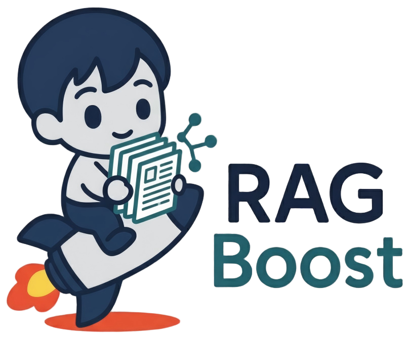

<div align="center">
  
</div>

# RAGBoost

## About

RAGBoost is a high-performance optimization system for Retrieval-Augmented Generation workloads. It is designed to maximize KV cache efficiency and reduce inference latency through intelligent context reuse and prefix sharing. Its core features include:

- **Intelligent Context Reordering and De-duplication**: Automatically reorders and de-duplicates retrieved documents within and across queries to maximize shared prefixes, reducing KV cache computation.

- **Multi-Turn Conversation Support**: Enables efficient multi-turn RAG conversations with automatic context de-duplication across turns, reducing redundant prefills while maintaining answer quality through location-based hints.

- **Tree-Based Scheduling**: Organizes query execution order based on hierarchical clustering trees, ensuring maximum prefix sharing across batches without redundant tree traversals.

- **Contextual Hints**: Preserves RAG accuracy with dynamically updated contexts.

- **Flexible Retrieval Integration**: Supports both BM25 (Elasticsearch) and vector search (FAISS) for document retrieval, with easy extensibility for custom retrieval methods.

- **Framework Compatibility**: Works seamlessly with inference engines that support prefix caching (e.g. SGLang, vLLM), compatible with models on Hugging Face.

## Performance

### Performance Highlight

#### Multi-session (Large Batch); 25k sequence length each; 8xH100


#### Multi-session & Multi-turn; Qwen3-4B-Instruct-2507; 1xH100


### Accuracy on MT-RAG

| Method | Qwen3-4B | Llama3.1-8B | Qwen3-30B-A3B |
|--------|----------|-------------|-----------|
| LMCache | 62.56 | **68.46** | 75.12 |
| CacheBlend | 50.33 | 56.52 | X |
| RadixCache | 62.56 | **68.46** | 75.12 |
| **RAGBoost** | **64.27** | 68.12 | **75.81** |

When integrated with modern LLM inference engines supporting prefix caching (e.g., SGLang and vLLM), RAGBoost delivers **4-13x** improvements in cache hit rates and **1.5-3.5x** reductions in prefill latency for large-batch multi-session and multi-turn RAG workloads, while maintaining or improving accuracy.

### GPU vs CPU Benchmarking Results

RAGBoost supports both GPU and CPU for distance computation in context index construction. Below are benchmark results (tested on NVIDIA A6000 GPU and AMD EPYC 7313P 16-Core CPU) showing performance across different dataset sizes:

| Metric | 64 | 128 | 512 | 4k | 8k | 12k | 100k |
|--------|-----|-----|-----|-------|-------|--------|---------|
| **GPU Time (s)** | 0.2214<br>± 0.2994 | 0.0161<br>± 0.0035 | 0.0497<br>± 0.0044 | 0.8903<br>± 0.0474 | 3.1906<br>± 0.2220 | 6.7734<br>± 0.4468 | 687.6356<br>± 0.0232 |
| **CPU Time (s)** | 0.1976<br>± 0.0011 | 0.2801<br>± 0.0022 | 1.0195<br>± 0.0117 | 52.0199<br>± 0.0649 | 211.4544<br>± 1.1234 | 490.9072<br>± 7.9752 | N/A |
| **Speedup** | 0.89x | 17.40x | 20.51x | 58.43x | 66.27x | 72.48x | N/A |

**Analysis:**

GPU performance advantage scales with problem size, from 0.89x at 64 contexts to 72.48x at 12k contexts. The crossover point occurs around 100-128 contexts where GPU begins to outperform CPU.

**Deployment Recommendations:**

- **Use CPU when:** Processing < 128 contexts, or when GPU resources are unavailable/expensive and latency requirements are not critical.
- **Use GPU when:** Processing ≥ 128 contexts for significant performance gains (17-72x), especially for batch processing and high-throughput production workloads.

Run your own benchmarks:
```bash
python tests/test_gpu_distance_performance.py
```

## Getting Started

- [Installation](#installation)
- [Quick Start](#quick-start) - Get started in few lines of code
- [Examples](examples/README.md) - Working code examples

## Installation

**Requirements:** Python >= 3.10

### Install from Source

```bash
git clone https://github.com/SecretSettler/RAGBoost.git
cd RAGBoost
pip install -e .
```

### Install Inference Engine

RAGBoost supports multiple inference engines with prefix caching capabilities:

- **SGLang**: See [SGLang Installation Guide](https://docs.sglang.ai/get_started/install.html)
- **vLLM**: See [vLLM Installation Guide](https://docs.vllm.ai/en/latest/getting_started/installation/)
- **LMCache**: See [LMCache Installation Guide](https://docs.lmcache.ai/getting_started/installation)

### Install FAISS (Optional)

For vector search functionality, install FAISS. Refer to the [official FAISS repository](https://github.com/facebookresearch/faiss) for detailed installation instructions.

Quick install via conda:
```bash
conda install conda-forge::faiss-gpu # For GPU support
# or
conda install conda-forge::faiss-cpu # For CPU only
```

### Using Docker

Pull pre-built image:
```bash
docker pull seanjiang01/ragboost-sgl-v0.5.5:latest
docker run -d --gpus all --name ragboost seanjiang01/ragboost-sgl-v0.5.5:latest
docker exec -it ragboost bash
```

## Quick Start

**Launch your inference service first (e.g. SGLang, vLLM, ...)**

### Retrieve and Optimize

The simplest way to use RAGBoost for retrieval and optimization:

```python
from ragboost.pipeline import RAGPipeline

# Create pipeline with RAGBoost enabled (default)
pipeline = RAGPipeline(
    retriever="bm25",
    corpus_path="corpus.jsonl",
    use_ragboost=True  # Enable optimization
)

# Run retrieval + optimization
results = pipeline.run(queries=[
    "What is artificial intelligence?",
    "What is machine learning?"
])

# Save optimized batch for inference
pipeline.save_results(results, "optimized_batch.jsonl")
```

### End-to-End with LLM Generation

For complete RAG pipeline with automatic prompt generation and inference:

```python
from ragboost.pipeline import RAGPipeline, InferenceConfig

# Create pipeline with inference config and RAGBoost enabled
pipeline = RAGPipeline(
    retriever="bm25",
    corpus_path="corpus.jsonl",
    use_ragboost=True,  # Enable optimization
    inference=InferenceConfig(
        model_name="Qwen/Qwen2.5-7B-Instruct",
        base_url="http://localhost:30000"
    )
)

# Run complete pipeline: retrieve → optimize → generate
results = pipeline.run(
    queries=["What is AI?"],
    generate_responses=True
)

# Access generated responses
for result in results["generation_results"]:
    print(result["generated_text"])
```

**What happens automatically:**
1. **Retrieval**: Fetches relevant documents from corpus
2. **Optimization** (if `use_ragboost=True`): Reorders contexts for maximum cache efficiency
3. **Prompt Generation**: Creates prompts with:
   - Retrieved documents (in optimized order)
   - Document importance ranking
   - Formatted instructions for the LLM
4. **Inference**: Sends to LLM API and collects responses

**Key Features:**
- Automatic retrieval, optimization, and prompt generation
- Easy toggle: `use_ragboost=True/False` to compare performance
- Multiple retrievers: BM25, FAISS, or custom
- Step-by-step control when needed
- Batch processing support for throughput control

**Learn more:**
- [Quick Start Guide](docs/QUICK_START.md) - Detailed tutorial
- [Multi-Turn Conversations](docs/MULTI_TURN.md) - Multi-turn RAG with context deduplication
- [Pipeline Reference](docs/PIPELINE_API.md) - Complete reference documentation
- [Batch Workflow Guide](docs/BATCH_WORKFLOW.md) - Large batch workflow pipeline details
- [Examples](examples/pipeline_examples.py) - Working examples

### Multi-Turn Conversations

RAGBoost supports efficient multi-turn conversations with automatic context deduplication:

```python
from ragboost.pipeline import RAGPipeline

pipeline = RAGPipeline(
    retriever="bm25",
    corpus_path="corpus.jsonl",
    use_ragboost=True
)

# Turn 1
result1 = pipeline.process_conversation_turn(
    conversation_id="user_123",
    query="What is machine learning?",
    top_k=5
)

# Turn 2 - automatically deduplicates overlapping documents
result2 = pipeline.process_conversation_turn(
    conversation_id="user_123",
    query="How does it differ from deep learning?",
    top_k=5
)

# Check deduplication savings
print(f"Deduplicated: {result2['deduplication_stats']['num_deduplicated']} docs")
print(f"Savings: {result2['deduplication_stats']['deduplication_rate']:.0%}")
```

**Benefits:**
- **30-60% deduplication rate** in typical conversations
- **Reduced prefill computation** by avoiding redundant document processing
- **Location hints** guide LLM to prior context without repeating content
- **Maintains answer quality** while improving efficiency

See [Multi-Turn Guide](docs/MULTI_TURN.md) for details and [examples/multi_turn_example.py](examples/multi_turn_example.py) for more examples.

## Roadmap

- [x] Offline batch processing pipeline
- [x] Hierarchical clustering for context grouping
- [x] Intra-context document reordering and de-duplication
- [x] Tree-based inter-context scheduling
- [x] Prompt generation with importance ranking
- [ ] Online API server with real-time caching
- [ ] Cache update mechanisms
- [ ] Support for GraphRAG
- [ ] Support for multi-modal models
- [ ] Advanced prefix cache optimizations

## Contributing

We welcome contributions! Please feel free to submit issues and pull requests.

## Contact

- [Yinsicheng Jiang](mailto:ysc.jiang@ed.ac.uk)
- [Yeqi Huang](mailto:yeqi.huang@ed.ac.uk)
- [Cheng Deng](mailto:cdeng@ed.ac.uk)
- [Liang Cheng](mailto:L.cheng@ed.ac.uk)
- [Xuan Sun](mailto:xuan.sun@ed.ac.uk)
- [Luo Mai](mailto:luo.mai@ed.ac.uk)

## Citation

If you use the code or data of RAGBoost, please declare the reference with the following:

```bibtex
@misc{jiang2025ragboost,
      title={RAGBoost: Efficient Retrieval-Augmented Generation with Accuracy-Preserving Context Reuse}, 
      author={Yinsicheng Jiang and Yeqi Huang and Liang Cheng and Cheng Deng and Xuan Sun and Luo Mai},
      year={2025},
      eprint={2511.03475},
      archivePrefix={arXiv},
      primaryClass={cs.LG},
      url={https://arxiv.org/abs/2511.03475}, 
}
```
